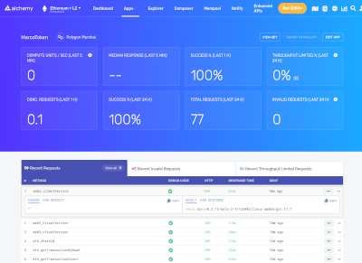
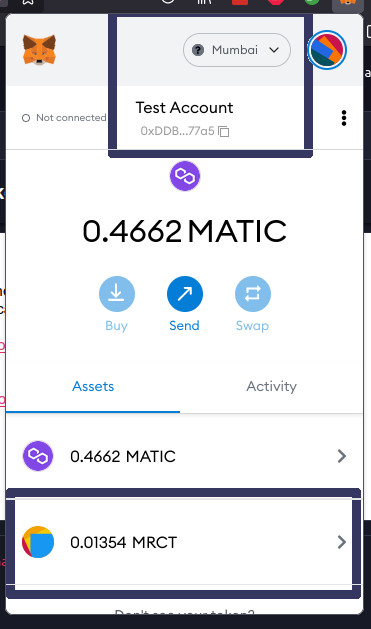
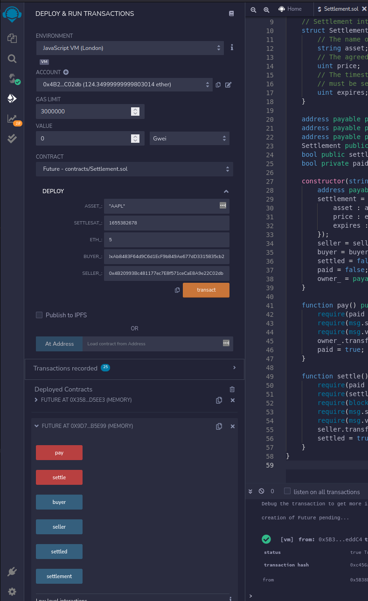

# Creating an ERC20 Token

*Created by M. Massenzio, 2022-04-15*



# Concepts

A `Smart Contract` is a program that runs on the ETH B/c, a collection of code/data that resides at a specific address; it is a type of `Account`, so it can send transactions over the network and has a balance.

An `account` is an entity with an ETH balance: it can

* receive,
* hold, and
* send

ETH and `Tokens`.

> Transactions from an external account to a contract account can trigger code which can execute many different actions, such as transferring tokens or even creating a new contract

Contract accounts have a 42 hex address (168 bits): it gets generated from the creator's address and their `nonce`.

Accounts have four fields:

* `nonce`
* `balance`
* `codeHash`
* `storageRoot` (or 'storage hash')


### Keys

An `Account` is protected by a `Private Key` which is made up of 64 hex characters (256 bits) and can be encrypted with a password.

`Public Key` is generated with an EC signature algorithm (Keccak-256), last 20 bytes.

### Ether and Wei

One `wei` is 10<sup>-18</sup> `ether`; one `gwei` is 10<sup>9</sup> `wei` and there are 10<sup>9</sup> `gwei` in 1 `ether`.

At current prices (4/24/2022) 1 ETH ~ 2,854 USD, so 1 USD ~ 350k `gwei`

With `gas` price hovering around 15-20 `gwei` this week, and a transaction costing 21,000 `gas`, sending a contract to the ETH blockchain costs around:

```
21,000 gas x 20 gwei / 350,00 = $1.20
```

plus the cost of the contract execution.


## Setup

Setting up the dev env with [REMIX](https://remix.ethereum.org/) and creating the first token: see the [Token.sol](contracts/MRCT.sol) source.

```typescript
contract MarcoToken is ERC20Capped, Ownable {

    // Specify the decimals: one Marco Token can be subdivided in 10^6
    // (one milion) Willies.
    uint TOKEN = 10**6;

    constructor(uint256 cap) ERC20("MarcoToken", "MRCT")
        ERC20Capped(cap) {
    }

    function issueTokens(uint tokens) public onlyOwner {
        _mint(msg.sender, tokens * TOKEN);
    }
}
```

For local development we use [Hardhat](https://hardhat.org/):

1. installed the latest [Node.js](https://nodejs.org) LTS via `nvm`

```
└─( nvm install 16.14.2

└─( node --version
v16.14.2

```

2. Install Hardhat

```
└─( npm init      

└─( npm install --save-dev hardhat
```

3. Initialize project with Hardhat

```
└─( npx hardhat
```

**TODO**
> Audit finds many vulnerabilities, some `high`: fix them

4. Install Ganache

For local development, we use [Ganache](https://trufflesuite.com/docs/ganache/) installed locally.

Download [the Linux AppInit file](https://trufflesuite.com/ganache/), `chmod +x` it and then execute it.

This will run a server on `http://127.0.0.1:8545` which will need to be configured in the `API_URL` (see the `ganache.env` configuration).

## Alchemy & MATIC

Created an account with [Alchemy](https://dashboard.alchemyapi.io/) and created my first app (`MarcoToken`), and configured to use the Mumbai Polygon network.

The API App key and the Metamask Wallet account have been saved in the `.env` file (added to `.gitignore`):

```
npm install dotenv
touch .env
echo ".env" >> .gitignore
vim .env
```

[Polygon](https://faucet.polygon.technology/) can be used to issue test tokens (`MATIC`) to use to deploy the `MarcoToken` (use your Wallet address, from Metamask).

Remember to enable test networks and to add Polygon Mumbai to the Metamask extension (using [Chainlist](https://chainlist.org/)).


## Code

Added support for OpenZeppelin:

    npm install @openzeppelin/contracts

and added `Token.sol` to be deployed via `deploy.js`.

Hardhat provides some basic functionality:

Used `npx hardhat compile` to compile my `contracts` to `artifacts` (these will be needed by `Web3Py` to extract the `ABI` and execute RPC calls against the contract).

## Deployment

Deploy with Hardhat using the `deploy.js` script

```
└─( npx hardhat run ./scripts/deploy.js --network mumbai
Token deployed to: 0x3ec2C1426A615F3bD59Ca31203657bc9E2e53d18
```
or locally to the Ganache blockchain:

```
└─( npx hardhat --network localhost run scripts/deploy.js
Contract deployed to: 0x308Bd7f1518E68cF1811ad00e4bbF185dDcca43c
```

The deployment of the Contract can be seen in the [TESTNET Polygon Explorer](https://mumbai.polygonscan.com/): use the address emitted by the script to confirm the transaction was successfully processed.

The token can then be added to Metamask walled, using the `Import Token` functionality and the contract's address, as emitted by the `deploy.js` script:



When running the `issue.js` script, we need a `Provider` (see [`ethers` API Providers](https://docs.ethers.io/v5/api/providers/api-providers/)); if the name of the provider is not one recognized, it will emit a cryptic error:

```
TypeError: Cannot read properties of null (reading 'name')
```

See the `AlchemyProvider` doc page for a list of allowed providers (we use `maticmum` for the Polygon Matic Mumbai testnet).


# Interacting with a Contract

# Future Contract

This is defined in the `Future.sol` Solidity code, and allows a `buyer` and `seller` to agree to exchange a security by a given time, or the contract will expire.



The `owner` of the contract (the address that deploys it) will collect a fee of `0.05 ETH` from the `seller` when they `pay()` for the contract: until the Future is paid, it cannot be settled - the `buyer` will then `settle()` the contract for the agreed-upon `value`, before the future expires (`expires_at` timestamp).

# Tests

This repository is configured to run tests against the newly crafted Solidity code via a number of Python tests which interact with the Contract itself.

To test any changes to the `.sol` file have been successful use:

    python -m unittest discover -s tests  


## References


- [How to Create and Deploy an ERC20 Token – In 20 minutes](https://vitto.cc/how-to-create-and-deploy-an-erc20-token-in-20-minutes/)

- [ERC20 Token standard](https://ethereum.org/en/developers/docs/standards/tokens/erc-20/) and [API Documentation](https://docs.openzeppelin.com/contracts/4.x/api/token/erc20)

- [Smart Contracts](https://ethereum.org/en/developers/docs/smart-contracts/)

- [Ethereum Accounts](https://ethereum.org/en/developers/docs/accounts/)

- [Build Sandbox](https://sandbox.eth.build/)

- [Ganache](https://trufflesuite.com/ganache/)

- [Web3Py](https://web3py.readthedocs.io/en/stable/)

- [Smart Contract Development with Solidity and Ethereum (O'Reilly online)](https://learning.oreilly.com/library/view/hands-on-smart-contract/9781492045250/)
